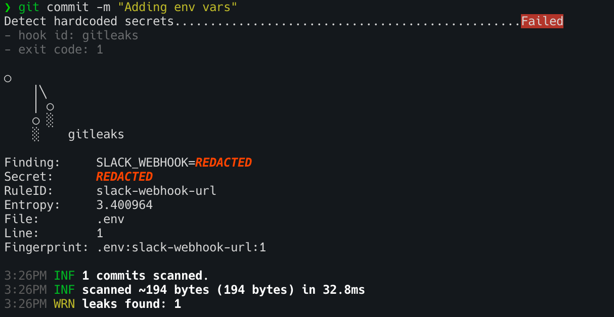
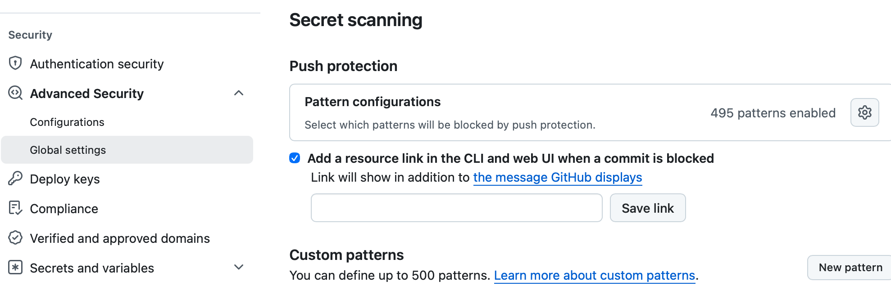
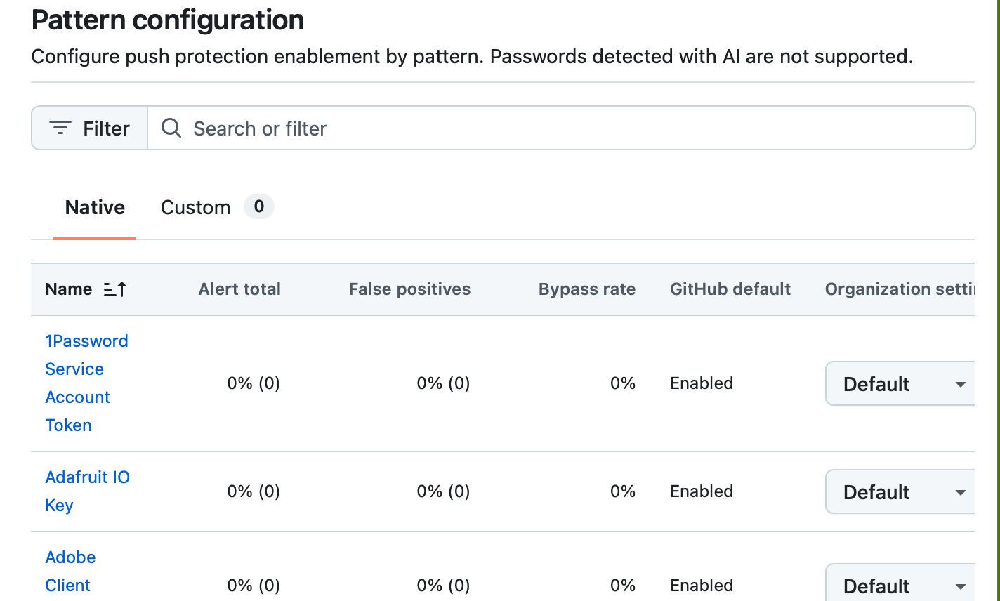
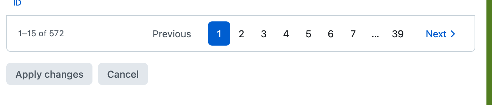
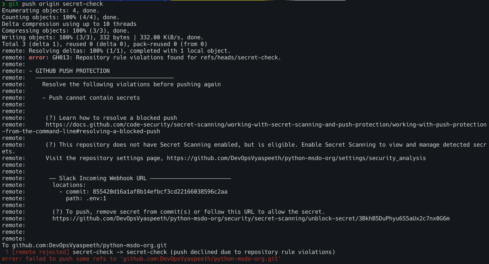
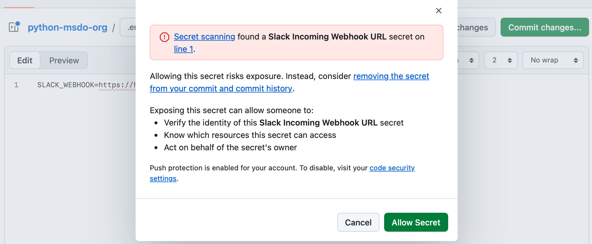

# Preventing Secret Leaks in Git History

Once a secret (API key, password, token, webhook URL) is committed to Git, it persists in the repository history — even if the file is later deleted or the line is removed. Attackers routinely scan public and private repos for leaked credentials. The only reliable strategy is to **prevent secrets from entering history in the first place**.

This document describes a **three-layer defense-in-depth** approach that blocks secrets at every stage — from the developer's machine to GitHub itself.

---

## Layer 1: Gitleaks on Developer Machines (Pre-Commit Hook) — *Optional*

[Gitleaks](https://github.com/gitleaks/gitleaks) is an open-source SAST tool purpose-built for detecting hardcoded secrets in Git repositories. When combined with the [pre-commit](https://pre-commit.com/) framework, it runs automatically on every `git commit` and **blocks the commit before any history is written** if a secret is detected.

> **Important:** This layer operates at the **commit level**, not the push level. It prevents secrets from being committed locally, giving the developer immediate feedback. However, it **can be bypassed** by running `git commit --no-verify`, which skips all pre-commit hooks. For this reason, Layer 1 is considered optional — **Layers 2 and 3 provide the server-side enforcement that cannot be bypassed.**

### How It Works

1. The developer stages files and runs `git commit`
2. The pre-commit hook invokes `gitleaks protect --staged` — scanning only the staged diff
3. If a secret pattern is matched, the commit is **rejected instantly**
4. The developer removes the secret and retries

### Setup

**Step 1:** Install pre-commit

```bash
pip install pre-commit
# or on macOS
brew install pre-commit
```

**Step 2:** Add `.pre-commit-config.yaml` to the repo root

```yaml
repos:
  - repo: https://github.com/gitleaks/gitleaks
    rev: v8.21.2   # pin to latest stable
    hooks:
      - id: gitleaks
```

**Step 3:** Install the hook

```bash
pre-commit install
```

From this point on, every `git commit` triggers the scan automatically.

### Proof: Commit Blocked on Secret Detection

The screenshot below shows a developer attempting to commit a `.env` file containing a Slack webhook URL. Gitleaks detects the secret, reports the finding with the rule ID (`slack-webhook-url`), file, and line number, and **fails the commit with exit code 1**.



> **Key detail:** The commit never completes — the secret is never written to local Git history. However, since this hook can be skipped with `git commit --no-verify`, server-side enforcement (Layers 2 and 3) is essential.

---

## Layer 2: GitHub Push Protection (Server-Side Block)

GitHub's built-in **Push Protection** is a server-side enforcement layer that blocks `git push` operations if known secret patterns are detected in the commits being pushed. This catches secrets even if a developer bypasses local hooks (e.g., `git commit --no-verify`).

### How It Works

1. Developer pushes commits to GitHub (CLI or web UI)
2. GitHub scans the push payload against **495+ native secret patterns** (AWS keys, Azure tokens, Slack webhooks, GCP credentials, etc.)
3. If a match is found, the **push is rejected** — the secret never reaches the remote repository

### Enabling Push Protection

Push Protection is configured at the **Organization level** under:

**Settings → Code security → Advanced Security → Global settings → Secret scanning → Push protection**



### Pattern Configuration

GitHub provides 495+ native patterns covering all major cloud providers and SaaS platforms. Each pattern can be individually enabled or disabled per the organization's needs. Custom patterns (up to 500) can also be defined.





### Proof: Push Blocked from CLI

The screenshot below shows a developer attempting `git push` after committing a `.env` file containing a Slack webhook URL (bypassing the local pre-commit hook). GitHub's Push Protection detects the **Slack Incoming Webhook URL** secret, returns error `GH013: Repository rule violations`, and **rejects the push entirely**. The secret never reaches the remote repository.



> **Key detail:** Even if a developer bypasses the local pre-commit hook with `--no-verify`, Push Protection catches the secret at push time and blocks it server-side. The push is `[remote rejected]` — the secret never lands in the remote repository.

### Proof: Push Blocked in GitHub Web UI

The same protection applies when committing directly in the GitHub web editor. The screenshot below shows GitHub identifying a **Slack Incoming Webhook URL** secret in a `.env` file and presenting a blocking dialog — the commit cannot proceed unless the developer explicitly chooses "Allow Secret" (which can be audited and restricted by org admins).



> **Key detail:** Push Protection works on both CLI pushes and web UI commits. Org admins can prevent developers from bypassing the block entirely.

---

## Layer 3: GitHub Actions CI Scan (Backstop)

Even with local hooks and Push Protection, a CI-level secret scan provides an additional safety net — especially for custom secret patterns not covered by GitHub's native detection, and for repos that may not yet have Push Protection enabled.

### Option A: Gitleaks Action

The same Gitleaks engine used locally, running as a GitHub Action on every push and pull request.

```yaml
name: Secret Scanning

on:
  push:
    branches: ["**"]
  pull_request:
    branches: ["**"]

jobs:
  gitleaks:
    name: Gitleaks Scan
    runs-on: ubuntu-latest
    steps:
      - name: Checkout repository
        uses: actions/checkout@v4
        with:
          fetch-depth: 0  # full history needed to scan all commits

      - name: Run Gitleaks
        uses: gitleaks/gitleaks-action@v2
        env:
          GITHUB_TOKEN: ${{ secrets.GITHUB_TOKEN }}
```

- `fetch-depth: 0` ensures all commits in the push/PR are scanned, not just the tip
- The action posts PR comments when a leak is detected, visible directly in the GitHub UI
- Can be made a **required status check** via branch protection to block merging

### Option B: TruffleHog Action

[TruffleHog](https://github.com/trufflesecurity/trufflehog) adds an extra capability: it **verifies** whether detected secrets are actually live and valid by testing them against their respective APIs.

```yaml
      - name: Run TruffleHog
        uses: trufflesecurity/trufflehog@main
        with:
          extra_args: --only-verified
```

- `--only-verified` reduces false positives by only reporting secrets confirmed to be active
- Useful as a complement to Gitleaks for high-confidence alerting

### Option C: Microsoft Security DevOps (MSDO)

MSDO includes **CredScan** among its suite of security tools and integrates natively with GitHub Advanced Security.

```yaml
      - name: MSDO Scan
        uses: microsoft/security-devops-action@latest
```

- Results upload to the GitHub **Security tab** as SARIF
- Best suited for organizations already using Microsoft Defender for DevOps

### Making CI Scans a Merge Gate

To ensure PRs cannot be merged when secrets are detected:

1. Go to **Settings → Branches → Branch protection rules** for `main`
2. Enable **Require status checks to pass before merging**
3. Add the secret scanning job (e.g., `Secret Scanning / Gitleaks Scan`) as a required check

---

## Defense-in-Depth Summary

| Layer | Tool | When It Runs | Blocks Before History? | Custom Patterns? |
|-------|------|-------------|----------------------|-----------------|
| **Local** *(optional)* | Gitleaks + pre-commit | Before `git commit` | ✅ Yes (but bypassable via `--no-verify`) | ✅ Yes (`.gitleaks.toml`) |
| **Server** | GitHub Push Protection | Before `git push` lands | ✅ Yes | ✅ Up to 500 custom |
| **CI/CD** | Gitleaks / TruffleHog / MSDO Action | On push or PR | ⚠️ PR only (requires branch protection) | ✅ Yes |

> **Why all three?** Local hooks can be bypassed with `--no-verify`. Push Protection only covers known partner patterns. CI catches everything else and creates an auditable record. Together, they form an airtight defense.

---

## Handling False Positives

Add a `.gitleaks.toml` configuration at the repo root to tune detection rules:

```toml
[extend]
useDefault = true  # extend Gitleaks' built-in ruleset

[[allowlists]]
description = "Allow test fixtures and known non-secrets"
paths = [
  '''tests/fixtures/.*''',
]
regexes = [
  '''EXAMPLE_KEY_.*''',
]
```

To suppress a specific line inline:

```python
api_key = "not-a-real-secret"  # gitleaks:allow
```

---

## Note: Rolling Out Gitleaks to Developer Machines

To ensure all developers on the team have the pre-commit hook active:

1. **Commit `.pre-commit-config.yaml`** to the repo — this is the source of truth for hook configuration
2. **Add `pre-commit install` to your onboarding process** — document it in `README.md` or `CONTRIBUTING.md` as a required setup step
3. **Automate via Makefile or setup script:**

```makefile
setup:
	pip install pre-commit
	pre-commit install
```

4. **CI as the safety net** — the GitHub Actions layer (Layer 3) ensures scans run even if a developer hasn't installed the local hook

> The local hook is a **developer convenience** that catches secrets early. The server-side layers (Push Protection + CI) are the **enforcement guarantee** that no secret reaches the repository regardless of local setup.
